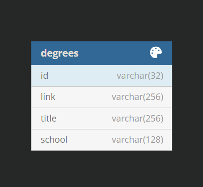
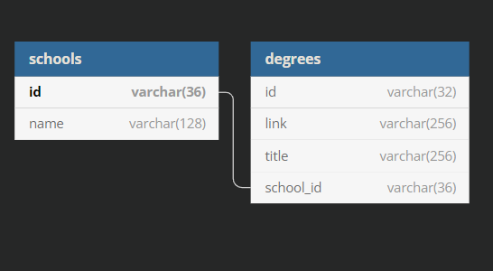

--Tools Used--

-XAMPP (includes Apache, PHP, and MySQL via phpMyAdmin); I chose this specific collection of tools as it is what I am most familiar with having used it in college (PLEASE NOTE: PHP version downgraded to 7.1.32 as phpMyAdmin has a bug preventing export with PHP 8 at time of work)

-Visual Studio Code (IDE); I chose to use vsCode as I have been utilizing it almost entirely for several months so I am most familiar with it

-dbdiagram.io (database schema visualizer); I chose this web based program as it is free and easy to work with

-GitHub (code repository); I chose GitHub to host my repository as I am familiar with it

--Biggest Decisions Made--

-Database Implementation(Non-relational); I chose to not do a relational database as I felt it was unnecessary for a project such as this where it did not seem like it would result in faster query response times or overall usability

-Styling Choices; I chose to utilize the IU web style guides colors and fonts as they are aesthetically pleasing and applicable to this position

--Notes--

Visual representation of Database Schema as Implemented

Visual representation of Database Schema if Implemented Relationally

